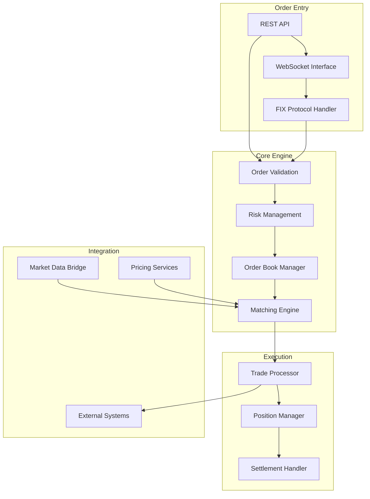



# FXOptEngine - Core Trading Engine

{: .fs-3 }
Central order matching and execution engine for FX options trading
{: .fs-6 .fw-300 }

---

## What It Does

FXOptEngine serves as the **heart of the Stream Systems trading platform**, providing sophisticated order matching and execution capabilities for foreign exchange options trading. This component handles the critical path from order entry through trade execution, managing order books, price discovery, and trade confirmations in real-time.

### Core Business Functions

#### 🎯 **Order Management**
- **Order Entry**: Accepts orders from multiple sources (UI, API, external systems)
- **Order Validation**: Pre-trade risk checks, credit limits, and regulatory compliance
- **Order Types**: Market, Limit, All-or-None (AON), Half-AON, Fill-or-Kill (FOK)
- **Order Book Management**: Maintains price-time priority order books for multiple currency pairs

#### ⚡ **Trade Execution**
- **Matching Engine**: Price-time priority matching with microsecond-level performance
- **Cross-Order Execution**: Sophisticated logic for complex multi-leg option strategies
- **Risk Management**: Real-time position monitoring and exposure calculation
- **Trade Confirmation**: Immediate execution reports and trade confirmations

#### 🔄 **Real-Time Operations**
- **Market Data Integration**: Real-time price feeds from Bloomberg and Thomson Reuters
- **Position Tracking**: Live position monitoring across all currency pairs and strategies
- **Settlement Processing**: T+2 settlement date calculations and coordination
- **Regulatory Reporting**: Automated trade reporting for compliance requirements

---

## How It Works

### Technical Architecture

FXOptEngine is built on a **high-performance C++17 architecture** designed for ultra-low latency trading operations:

### Key Technical Components

#### **Multi-Threaded Architecture**
- **Thread Pool**: 30-thread pool for asynchronous order processing
- **Producer-Consumer Pattern**: Queue-based message processing for scalability
- **Atomic Operations**: Lock-free operations where possible for performance
- **Specialized Mutexes**: 15+ targeted mutexes for different subsystems

#### **Order Matching Algorithm**
- **Complexity**: O(log n) for basic operations, O(n²) for deferred AON processing
- **Price-Time Priority**: Standard institutional trading priority rules
- **Deferred Processing**: Special handling for All-or-None orders
- **Cross-Order Logic**: Multi-leg strategy execution capabilities

#### **Memory Management**
- **RAII Principles**: Resource acquisition and cleanup in constructors/destructors
- **Smart Pointers**: Boost shared_ptr for automatic memory management
- **Exception Safety**: Comprehensive exception handling with proper cleanup
- **Memory Pools**: Custom allocation for high-frequency operations

### Integration Patterns

**External System Connectivity:**
- **FIX Protocol**: Full FIX 4.2, 4.3, 4.4, 5.0SP1 support with session management
- **Solace Messaging**: Enterprise messaging with guaranteed delivery and reconnection
- **Database Operations**: PostgreSQL with connection pooling and transaction management
- **Market Data**: Real-time feeds from Bloomberg API and Thomson Reuters

---

## Current Status & Health

### ✅ **Production Strengths**

{: .highlight-box }
**Core Functionality**: The engine successfully handles **complex FX options trading workflows** with proven **reliability** and **institutional-grade performance**.

**Key Capabilities:**
- **Proven Performance**: Microsecond-level order processing in production
- **Robust Order Book**: Comprehensive order management with price-time priority
- **Real-Time Processing**: Sub-millisecond market data updates and position tracking
- **Comprehensive Integration**: Full connectivity to major market data providers and trading networks

### ⚠️ **Current Limitations**

{: .note }
**Technology Stack**: While **functionally robust**, the component requires **modernization** to address **security vulnerabilities** and **performance bottlenecks**.

**Areas Needing Attention:**

1. **Security Framework** 🔒 *Critical Priority*
   - Missing authentication mechanisms for API endpoints
   - Hardcoded credentials in configuration files
   - CORS misconfiguration allowing all origins

2. **Performance Optimization** ⚡ *High Priority*
   - Excessive mutex usage causing lock contention
   - Synchronous database operations blocking critical paths
   - Memory allocation patterns causing fragmentation

3. **Code Quality** 📋 *Medium Priority*
   - Large component files exceeding best practices
   - Complex algorithms with high cyclomatic complexity
   - Limited comprehensive unit testing coverage

### 🔴 **Key Risk Areas**

{: .financial-data }
**Security Risk**: HIGH - Hardcoded credentials and missing authentication could expose the system to unauthorized access.

| Risk Category | Impact | Status | Resolution Timeline |
|---------------|--------|--------|-------------------|
| **Hardcoded Credentials** | Critical | Active | 1-2 weeks |
| **CORS Misconfiguration** | High | Active | 1 week |
| **Performance Bottlenecks** | High | Active | 2-4 weeks |
| **Missing Authentication** | Critical | Active | 2-3 weeks |

*For detailed technical analysis, see [Technical Risk Assessment](../technical-risk-assessment.html)*

---

## Required Improvements

### 🔴 **MUST DO - Critical Security & Stability**

**Timeline: 4-6 weeks | Estimated Cost: $75,000 - $100,000**

#### **1. Security Hardening**
- **Remove hardcoded credentials** from configuration files
- **Implement authentication/authorization** for all API endpoints
- **Fix CORS policies** to restrict origins to specific domains
- **Add input validation** and sanitization for all endpoints

#### **2. Performance Critical Fixes**
- **Optimize mutex usage** to reduce lock contention
- **Implement async database operations** for non-critical paths
- **Fix memory allocation patterns** to prevent fragmentation
- **Add connection pooling** for external service calls

#### **3. Operational Stability**
- **Implement circuit breaker pattern** for external services
- **Add comprehensive error handling** and retry mechanisms
- **Establish health checks** and monitoring endpoints
- **Create operational runbooks** and emergency procedures

### 🟡 **SHOULD DO - Performance & Maintainability**

**Timeline: 8-12 weeks | Estimated Cost: $150,000 - $200,000**

#### **1. Algorithm Optimization**
- **Implement lock-free data structures** for order book operations
- **Simplify deferred processing logic** for AON orders
- **Optimize string operations** and reduce copying overhead
- **Add memory pools** and pre-allocation strategies

#### **2. Code Quality Improvements**
- **Decompose large component files** into focused modules
- **Reduce cyclomatic complexity** in matching algorithms
- **Add comprehensive unit testing** framework
- **Implement static code analysis** and quality gates

#### **3. Monitoring & Observability**
- **Add detailed performance metrics** collection
- **Implement distributed tracing** for request flow
- **Create business metrics dashboards** for trading operations
- **Establish automated alerting** for system health

### 🟢 **COULD DO - Advanced Features**

**Timeline: 6-12 months | Estimated Cost: $300,000 - $500,000**

#### **1. Architecture Modernization**
- **Implement microservices architecture** for better scalability
- **Add horizontal scaling capabilities** with load balancing
- **Implement event sourcing** for comprehensive audit trails
- **Add machine learning** for predictive risk management

#### **2. Advanced Trading Features**
- **Implement sophisticated order types** (iceberg, hidden, etc.)
- **Add algorithmic trading support** with execution strategies
- **Implement cross-venue arbitrage** detection and execution
- **Add real-time risk analytics** and position optimization

---

## Business Impact

### Revenue Protection

{: .highlight-box }
**Client Impact**: Current performance bottlenecks and security vulnerabilities pose risks to client confidence and regulatory compliance.

**Critical Metrics:**
- **Order Processing Latency**: Currently variable, target <100 microseconds
- **System Availability**: 99.9% target requires improved failover mechanisms
- **Regulatory Compliance**: Security gaps could impact compliance certifications
- **Client Onboarding**: Technology debt limits ability to onboard new institutional clients

### Growth Enablement

**Competitive Advantages After Improvements:**
- **Ultra-Low Latency**: Sub-100 microsecond processing competitive with major platforms
- **Advanced Order Types**: Enhanced order management capabilities
- **Scalable Architecture**: Support for increased trading volumes and client growth
- **Regulatory Readiness**: Comprehensive compliance framework for global markets

---

## Technical Specifications

### Performance Characteristics

| Metric | Current | Target | Improvement Needed |
|--------|---------|--------|-------------------|
| **Order Processing** | Variable | <100μs | Performance optimization |
| **Throughput** | 10,000 orders/sec | 50,000 orders/sec | Algorithm optimization |
| **Memory Usage** | 2-4GB | <2GB | Memory management |
| **Availability** | 99.5% | 99.9% | Failover implementation |

### Technology Stack

**Core Technologies:**
- **Language**: C++17 with Boost Libraries
- **Threading**: Multi-threaded with thread pools
- **Protocols**: FIX 4.2, 4.3, 4.4, 5.0SP1
- **Messaging**: Solace PubSub+ with guaranteed delivery
- **Database**: PostgreSQL with connection pooling
- **Market Data**: Bloomberg API, Thomson Reuters

**Key Dependencies:**
- **Boost Libraries**: Advanced C++ functionality
- **QuickFIX**: FIX protocol implementation
- **PostgreSQL libpqxx**: Database connectivity
- **Solace Client**: Enterprise messaging

---

## Implementation Roadmap

### Phase 1: Critical Security & Stability (Weeks 1-6)
- **Week 1-2**: Security assessment and emergency patches
- **Week 3-4**: Authentication/authorization implementation
- **Week 5-6**: Performance optimization and stabilization

### Phase 2: Performance & Quality (Weeks 7-18)
- **Week 7-10**: Algorithm optimization and code refactoring
- **Week 11-14**: Testing framework and quality improvements
- **Week 15-18**: Monitoring and observability implementation

### Phase 3: Advanced Features (Months 6-12)
- **Months 6-8**: Architecture modernization planning and design
- **Months 9-11**: Advanced trading features implementation
- **Month 12**: Production deployment and performance validation

---

## Success Metrics

### Technical KPIs
- **Latency**: Order processing under 100 microseconds
- **Throughput**: 50,000+ orders per second sustained
- **Availability**: 99.9% uptime with <1 minute recovery time
- **Security**: Zero critical vulnerabilities in quarterly assessments

### Business KPIs
- **Client Satisfaction**: Improved order execution performance
- **Regulatory Compliance**: 100% compliance with reporting requirements
- **Operational Efficiency**: 50% reduction in manual intervention requirements
- **Growth Support**: Platform ready for 3x volume increase

---

*FXOptEngine represents the core trading capabilities of the Stream Systems platform. Successful modernization of this component is critical for maintaining competitive positioning and supporting business growth objectives.*

---

**Component Owner**: Trading Technology Team  
**Last Technical Review**: July 17, 2025  
**Next Review**: January 17, 2026 