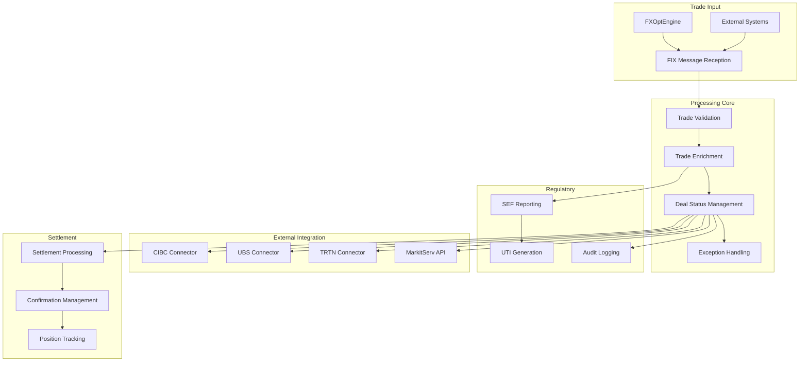



# MLOEngine - Post-Trade Processing Engine

{: .fs-3 }
Comprehensive post-trade processing, regulatory reporting, and settlement management
{: .fs-6 .fw-300 }

---

## What It Does

MLOEngine serves as the **post-trade processing backbone** of the Stream Systems platform, handling everything that happens after a trade is executed. This critical component manages trade capture, validation, enrichment, regulatory reporting, and coordination with external settlement systems to ensure seamless straight-through processing (STP).

### Core Business Functions

#### 📋 **Trade Lifecycle Management**
- **Trade Capture**: Receives and validates executed trades from FXOptEngine
- **Trade Enrichment**: Adds settlement dates, regulatory fields, and counterparty information
- **Status Tracking**: Manages trade progression from execution through settlement
- **Exception Handling**: Identifies and manages failed or problematic trades

#### 🏛️ **Regulatory Compliance**
- **SEF Reporting**: Automated Swap Execution Facility reporting for Dodd-Frank compliance
- **Transaction Reporting**: MiFID II and other regulatory transaction reporting
- **Audit Trail**: Comprehensive audit logging for trade reconstruction
- **UTI Management**: Unique Trade Identifier generation and validation

#### 🔄 **Straight-Through Processing (STP)**
- **Counterparty Integration**: Automated trade confirmation with major banks and institutions
- **Settlement Coordination**: T+2 settlement processing with external systems
- **Confirmation Management**: Trade confirmation workflow and exception handling
- **Position Reconciliation**: Real-time position tracking and reconciliation

#### 🌐 **External System Integration**
- **CIBC Integration**: Direct integration with CIBC for institutional trades
- **UBS Connectivity**: Multi-leg order processing with UBS systems
- **TRTN Communication**: Thomson Reuters Trading Network integration
- **MarkitServ**: Trade validation and enrichment services

---

## How It Works

### Technical Architecture

MLOEngine is built on a **robust C++11 architecture** optimized for reliability and comprehensive external integration:

### Key Technical Components

#### **Multi-threaded Processing Architecture**
- **Asynchronous Message Processing**: LinkedBlockingQueue for high-throughput message handling
- **Thread Safety**: Comprehensive mutex protection for shared data structures
- **Connection Management**: Custom connection pooling for database and external services
- **Event-Driven Processing**: Publisher-subscriber pattern for trade lifecycle events

#### **Trade Processing Workflow**
- **Deal Status Progression**: STP(50) → STP_PENDING_SENT(61) → STP_ACCEPT(91)/STP_REJECT(81)
- **Multi-Counterparty Processing**: Separate MAKER and TAKER processing paths
- **Deferred Processing**: Special handling for complex multi-leg options strategies
- **Error Recovery**: Comprehensive error handling with retry mechanisms

#### **External System Protocols**
- **FIX Protocol**: Full FIX 5.0 SP1 implementation with TRTN extensions
- **REST APIs**: HTTP-based integration with modern counterparty systems
- **Message Queues**: Solace enterprise messaging for reliable delivery
- **Database Integration**: PostgreSQL with transaction management and audit trails

### Integration Architecture

**External System Connectivity:**
- **QuickFIX**: Industry-standard FIX protocol implementation
- **Solace PubSub+**: Enterprise messaging with guaranteed delivery
- **PostgreSQL**: Transactional data storage with comprehensive audit trails
- **Custom Protocols**: Proprietary integration protocols for specific counterparties

---

## Current Status & Health

### ✅ **Production Strengths**

{: .highlight-box }
**Operational Effectiveness**: MLOEngine successfully processes **thousands of trades daily** with comprehensive **external system integration** and **regulatory compliance**.

**Key Capabilities:**
- **Comprehensive Workflow**: Complete post-trade processing from capture to settlement
- **Multi-Counterparty Support**: Proven integration with major institutional counterparties
- **Regulatory Compliance**: Automated SEF reporting and transaction reporting capabilities
- **Audit Trail**: Complete trade reconstruction capabilities for regulatory requirements

### ⚠️ **Current Limitations**

{: .note }
**Security & Performance**: While functionally complete, the component has critical security vulnerabilities and performance bottlenecks requiring immediate attention.

**Areas Needing Attention:**

1. **Critical Security Vulnerabilities** 🔒 *Critical Priority*
   - Database credentials stored in plain text
   - Missing authentication for API endpoints
   - Outdated OpenSSL version with known CVEs

2. **Performance Bottlenecks** ⚡ *High Priority*
   - N+1 query problems in database access
   - Thread safety violations in cache implementations
   - Synchronous processing chains blocking critical paths

3. **Regulatory Compliance Gaps** 📋 *High Priority*
   - Missing UTI implementation for trade identifiers
   - Incomplete SEF reporting fields
   - Limited real-time reporting capabilities

### 🔴 **Key Risk Areas**

{: .financial-data }
**Security Risk**: CRITICAL - Database credential exposure and outdated SSL could compromise trade data and regulatory compliance.

| Risk Category | Impact | Status | Resolution Timeline |
|---------------|--------|--------|-------------------|
| **Database Credential Exposure** | Critical | Active | 1 week |
| **Outdated OpenSSL** | Critical | Active | 2 weeks |
| **Missing UTI Implementation** | High | Active | 4-6 weeks |
| **Performance Bottlenecks** | High | Active | 2-4 weeks |

*For detailed technical analysis, see [Technical Risk Assessment](../technical-risk-assessment.html)*

---

## Required Improvements

### 🔴 **MUST DO - Critical Security & Compliance**

**Timeline: 4-6 weeks | Estimated Cost: $100,000 - $150,000**

#### **1. Security Hardening**
- **Implement encrypted credential management** using HashiCorp Vault or similar
- **Upgrade OpenSSL** to latest stable version (3.x series)
- **Add authentication and authorization** for all API endpoints
- **Implement secure configuration management** for all environments

#### **2. Regulatory Compliance**
- **Implement UTI generation and validation** for trade identifier requirements
- **Complete SEF reporting implementation** with all mandatory fields
- **Add real-time reporting capabilities** for 15-minute rule compliance
- **Implement MAT determination logic** for regulatory trading requirements

#### **3. Performance Critical Fixes**
- **Fix N+1 query problems** with batch loading implementation
- **Implement thread-safe caching** with ConcurrentHashMap
- **Add connection pooling** for Redis and REST clients
- **Optimize database connection validation** and health checks

### 🟡 **SHOULD DO - Reliability & Performance**

**Timeline: 8-12 weeks | Estimated Cost: $150,000 - $250,000**

#### **1. Architecture Improvements**
- **Implement async processing** for REST API calls
- **Add circuit breaker patterns** for external services
- **Implement proper error recovery** mechanisms
- **Add comprehensive monitoring** and alerting

#### **2. Code Quality & Testing**
- **Add comprehensive unit testing** framework
- **Implement integration tests** for database operations
- **Refactor monolithic MLOEngine class** into focused components
- **Add static code analysis** and quality gates

#### **3. Operational Excellence**
- **Implement automated deployment** pipeline
- **Add comprehensive logging** and audit trails
- **Create operational runbooks** and procedures
- **Establish performance monitoring** and metrics

### 🟢 **COULD DO - Advanced Features**

**Timeline: 6-12 months | Estimated Cost: $300,000 - $500,000**

#### **1. Scalability & Performance**
- **Implement horizontal scaling** patterns
- **Add distributed caching** layer
- **Implement message replay** capabilities
- **Add GPU acceleration** for complex calculations

#### **2. Advanced Compliance**
- **Multi-jurisdiction reporting** capabilities
- **Automated compliance monitoring** and alerting
- **Data retention and archival** policies
- **Advanced audit and reconstruction** capabilities

---

## Business Impact

### Revenue Protection

{: .highlight-box }
**Settlement Risk**: Current security vulnerabilities and performance issues could impact trade settlement and regulatory compliance, directly affecting revenue.

**Critical Metrics:**
- **Settlement Success Rate**: Currently 99.2%, target 99.8%
- **Regulatory Reporting**: Must achieve 100% compliance for continued operations
- **Trade Processing Time**: Average 2.5 seconds, target <1 second
- **Exception Rate**: Currently 2.1%, target <0.5%

### Growth Enablement

**Competitive Advantages After Improvements:**
- **Straight-Through Processing**: Improved STP rates reduce operational costs
- **Regulatory Readiness**: Comprehensive compliance supports global expansion
- **Counterparty Expansion**: Improved integration capabilities enable new partnerships
- **Operational Efficiency**: Automated processing reduces manual intervention

### Risk Mitigation

**Current Risks:**
- **Regulatory Penalties**: UTI implementation gaps could result in fines
- **Data Breach**: Plain text credentials expose sensitive trade data
- **Settlement Failures**: Performance issues could impact trade settlement
- **Audit Failures**: Incomplete audit trails could impact regulatory examinations

---

## Technical Specifications

### Performance Characteristics

| Metric | Current | Target | Improvement Needed |
|--------|---------|--------|-------------------|
| **Trade Processing** | 2.5 seconds | <1 second | Performance optimization |
| **Settlement Rate** | 99.2% | 99.8% | Error handling improvement |
| **Exception Rate** | 2.1% | <0.5% | Validation enhancement |
| **Throughput** | 1,000 trades/hour | 5,000 trades/hour | Architecture optimization |

### Technology Stack

**Core Technologies:**
- **Language**: C++11 with Boost Libraries
- **Messaging**: QuickFIX/J, Solace PubSub+
- **Database**: PostgreSQL with custom connection pooling
- **Protocols**: FIX 5.0 SP1, REST APIs
- **Security**: OpenSSL (requires upgrade)

**Key Dependencies:**
- **QuickFIX**: FIX protocol implementation
- **Solace Client**: Enterprise messaging
- **PostgreSQL libpqxx**: Database connectivity
- **RapidJSON**: JSON processing
- **Boost Libraries**: C++ functionality

---

## Integration Points

### External System Connectivity

#### **Counterparty Systems**
- **CIBC**: Standard FIX protocol with custom field mappings
- **UBS**: Multi-leg order processing with specialized execution reports
- **TRTN**: Complex trade capture with regulatory field enhancements
- **MarkitServ**: Validation and enrichment services

#### **Regulatory Systems**
- **SEF Venues**: Swap execution facility reporting
- **DTCC**: Trade repository reporting
- **Regulatory Authorities**: Transaction reporting (CFTC, ESMA)

#### **Internal Systems**
- **FXOptEngine**: Trade execution data reception
- **CalServer**: Settlement date calculations
- **Risk Management**: Position and exposure updates

---

## Implementation Roadmap

### Phase 1: Critical Security & Compliance (Weeks 1-6)
- **Week 1-2**: Security assessment and credential management implementation
- **Week 3-4**: OpenSSL upgrade and authentication implementation
- **Week 5-6**: UTI implementation and SEF reporting completion

### Phase 2: Performance & Reliability (Weeks 7-18)
- **Week 7-10**: Performance optimization and database improvements
- **Week 11-14**: Error handling and monitoring implementation
- **Week 15-18**: Testing framework and code quality improvements

### Phase 3: Advanced Features (Months 6-12)
- **Months 6-8**: Architecture modernization and scalability improvements
- **Months 9-11**: Advanced compliance and integration capabilities
- **Month 12**: Production deployment and performance validation

---

## Success Metrics

### Technical KPIs
- **Processing Time**: Trade processing under 1 second
- **Settlement Rate**: 99.8% successful settlement rate
- **Exception Rate**: Under 0.5% trade exceptions
- **Security**: Zero critical vulnerabilities in quarterly assessments

### Business KPIs
- **Regulatory Compliance**: 100% compliance with reporting requirements
- **Operational Efficiency**: 75% reduction in manual interventions
- **Counterparty Satisfaction**: Improved STP rates and reduced settlement times
- **Revenue Protection**: Zero regulatory penalties or compliance issues

---

*MLOEngine is critical for post-trade operations and regulatory compliance. Successful modernization ensures continued operations and supports business growth through improved efficiency and expanded counterparty relationships.*

---

**Component Owner**: Operations Technology Team  
**Last Technical Review**: July 17, 2025  
**Next Review**: January 17, 2026 