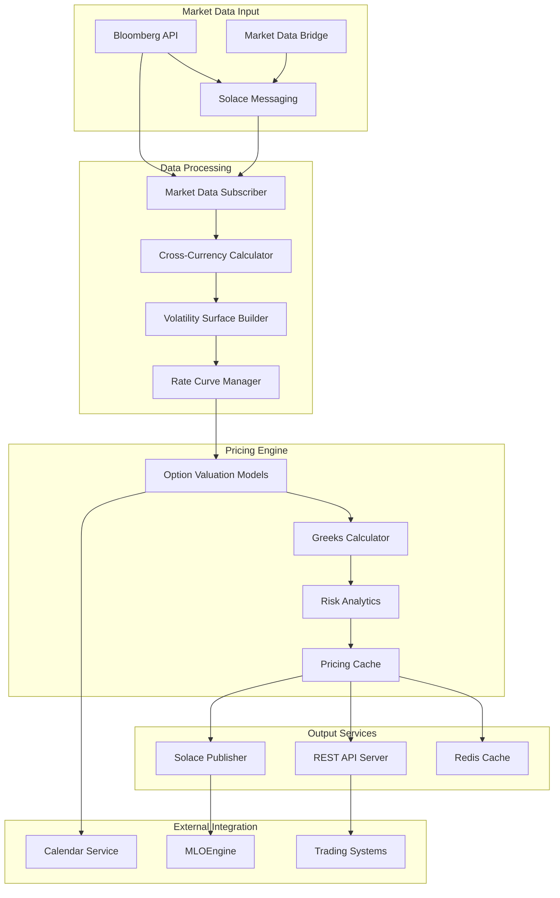



# PrePricer - Real-Time Pricing Engine

{: .fs-3 }
High-performance FX options pricing engine with Bloomberg integration and advanced mathematical models
{: .fs-6 .fw-300 }

---

## What It Does

PrePricer serves as the **pricing backbone** of the Stream Systems platform, providing real-time, accurate pricing for foreign exchange options and derivatives. This critical component processes market data, constructs volatility surfaces, and calculates option valuations with institutional-grade precision required for competitive trading operations.

### Core Business Functions

#### 💰 **Real-Time Option Pricing**
- **FX Options Valuation**: Comprehensive pricing for vanilla and exotic FX options
- **Greeks Calculation**: Delta, gamma, vega, theta, rho for risk management
- **Multi-Currency Support**: Pricing across all major currency pairs
- **Complex Structures**: Multi-leg strategies and barrier options

#### 📊 **Market Data Processing**
- **Bloomberg Integration**: Real-time market data via Bloomberg API
- **Volatility Surface Construction**: Advanced smile and skew modeling
- **Rate Curve Management**: Interest rate and forward curve processing
- **Cross-Currency Calculations**: FX forward and spot rate processing

#### ⚡ **High-Performance Computing**
- **Sub-Second Pricing**: Real-time pricing updates for active markets
- **Concurrent Processing**: Multi-threaded architecture for scalability
- **Caching Strategy**: Redis-based caching for frequently accessed data
- **API Services**: REST endpoints for pricing requests and market data

#### 🔄 **Integration Services**
- **MLOEngine Communication**: Pricing integration for post-trade processing
- **Calendar Services**: Business day and settlement date calculations
- **External Publishing**: Solace messaging for pricing distribution

---

## How It Works

### Technical Architecture

PrePricer is built on a **high-performance C++17 architecture** optimized for low-latency financial calculations:

### Key Technical Components

#### **Mathematical Pricing Models**
- **Black-Scholes-Merton**: Standard European option pricing with dividends
- **Barrier Options**: Single and double barrier options with rebates
- **American Options**: Early exercise premium calculations
- **Custom Number Class**: Financial-grade precision with metadata tracking

#### **Volatility Surface Management**
- **Smile Construction**: Risk reversal and butterfly volatility parameters
- **Surface Interpolation**: Multi-dimensional interpolation across strike and time
- **Arbitrage Checking**: Validation of volatility surface consistency
- **Real-Time Updates**: Dynamic surface reconstruction from market data

#### **High-Performance Architecture**
- **Dual-Mode Operation**: Cache subscriber mode and REST server mode
- **Memory Management**: Custom allocation patterns for low-latency operations
- **Lock-Free Structures**: Atomic operations for concurrent market data processing
- **Connection Pooling**: Optimized database and Redis connections

### Integration Architecture

**External System Connectivity:**
- **Bloomberg BLPAPI**: Real-time market data subscription and historical requests
- **Solace Messaging**: Enterprise messaging for market data distribution
- **Redis Cache**: High-performance data storage and retrieval
- **PostgreSQL Database**: Persistent storage for configuration and historical data

---

## Current Status & Health

### ✅ **Production Strengths**

{: .highlight-box }
**Mathematical Excellence**: PrePricer delivers institutional-grade pricing accuracy with sophisticated mathematical models that meet professional trading requirements.

**Key Capabilities:**
- **Proven Accuracy**: 12-decimal place precision in option valuations
- **Real-Time Performance**: Sub-second pricing updates for active markets
- **Bloomberg Integration**: Robust real-time market data processing
- **Comprehensive Models**: Support for vanilla and exotic options pricing

### ⚠️ **Current Limitations**

{: .note }
**Security & Performance**: While mathematically robust, the component has critical security vulnerabilities and performance bottlenecks requiring immediate attention.

**Areas Needing Attention:**

1. **Critical Security Vulnerabilities** 🔒 *Critical Priority*
   - CORS misconfiguration allowing all origins (*)
   - Missing authentication mechanisms for API endpoints
   - Outdated OpenSSL 1.1.1 (end-of-life)

2. **Performance Bottlenecks** ⚡ *High Priority*
   - Cross-currency calculation bottlenecks during startup
   - Single Redis instance without clustering
   - Synchronous cache operations blocking processing

3. **Operational Readiness** 📋 *Medium Priority*
   - Limited error handling in critical pricing algorithms
   - Insufficient monitoring and alerting capabilities
   - Missing comprehensive logging framework

### 🔴 **Key Risk Areas**

{: .financial-data }
**Security Risk**: HIGH - CORS misconfiguration and missing authentication expose pricing data to unauthorized access.

| Risk Category | Impact | Status | Resolution Timeline |
|---------------|--------|--------|-------------------|
| **CORS Misconfiguration** | High | Active | 1 week |
| **Missing Authentication** | Critical | Active | 2 weeks |
| **Outdated OpenSSL** | High | Active | 2 weeks |
| **Redis Single Point of Failure** | High | Active | 3-4 weeks |

*For detailed technical analysis, see [Technical Risk Assessment](../technical-risk-assessment.html)*

---

## Required Improvements

### 🔴 **MUST DO - Critical Security & Stability**

**Timeline: 4-6 weeks | Estimated Cost: $75,000 - $125,000**

#### **1. Security Hardening**
- **Fix CORS configuration** to restrict origins to specific domains
- **Implement JWT/API key authentication** for all endpoints
- **Upgrade OpenSSL** to latest stable version (3.x series)
- **Add comprehensive input validation** for all API requests

#### **2. Performance Critical Fixes**
- **Implement Redis clustering** for high availability
- **Add connection pooling** for database and Redis operations
- **Optimize cross-currency calculations** with bulk loading
- **Convert synchronous operations** to asynchronous where appropriate

#### **3. Reliability Improvements**
- **Implement circuit breaker pattern** for external dependencies
- **Add comprehensive error handling** in pricing algorithms
- **Establish health checks** and monitoring endpoints
- **Create operational runbooks** for production support

### 🟡 **SHOULD DO - Performance & Observability**

**Timeline: 8-12 weeks | Estimated Cost: $150,000 - $200,000**

#### **1. Performance Optimization**
- **Implement memory pools** for frequent allocations
- **Add binary serialization** for performance-critical data paths
- **Optimize JSON processing** overhead with custom parsers
- **Implement cache warming** strategies for critical data

#### **2. Monitoring & Observability**
- **Add detailed performance metrics** collection
- **Implement distributed tracing** for request flow
- **Create pricing accuracy monitoring** and validation
- **Establish automated alerting** for system health

#### **3. Code Quality & Testing**
- **Add comprehensive unit testing** framework
- **Implement integration tests** for pricing accuracy
- **Add static code analysis** and quality gates
- **Improve error message quality** and logging

### 🟢 **COULD DO - Advanced Features**

**Timeline: 6-12 months | Estimated Cost: $300,000 - $500,000**

#### **1. Advanced Mathematical Models**
- **Implement Heston model** for stochastic volatility
- **Add local volatility models** for exotic pricing
- **Implement model calibration** capabilities
- **Add Greeks calculation** for exotic options

#### **2. Scalability & Performance**
- **Implement horizontal scaling** with load balancing
- **Add GPU acceleration** for mathematical computations
- **Implement model validation** and backtesting
- **Add machine learning** for volatility prediction

---

## Business Impact

### Revenue Protection

{: .highlight-box }
**Pricing Accuracy**: Current security vulnerabilities could expose proprietary pricing models, while performance issues impact competitive positioning.

**Critical Metrics:**
- **Pricing Latency**: Currently variable, target <50ms
- **Pricing Accuracy**: Maintains 12-decimal precision requirement
- **System Availability**: 99.5% current, target 99.9%
- **Market Data Coverage**: 100% for major currency pairs

### Competitive Advantage

**Pricing Capabilities:**
- **Real-Time Updates**: Sub-second market data processing
- **Mathematical Sophistication**: Advanced volatility modeling
- **Integration Depth**: Comprehensive Bloomberg connectivity
- **Precision Standards**: Institutional-grade accuracy requirements

### Growth Enablement

**Expansion Capabilities After Improvements:**
- **Increased Throughput**: Support for higher frequency pricing requests
- **New Product Support**: Enhanced exotic options pricing capabilities
- **Geographic Expansion**: Improved latency for global market data
- **Client Onboarding**: Reliable pricing for new institutional clients

---

## Technical Specifications

### Performance Characteristics

| Metric | Current | Target | Improvement Needed |
|--------|---------|--------|-------------------|
| **Pricing Latency** | Variable | <50ms | Performance optimization |
| **Throughput** | 1,000 req/sec | 10,000 req/sec | Architecture optimization |
| **Memory Usage** | 1-2GB | <1GB | Memory management |
| **Cache Hit Rate** | 60% | 90% | Caching strategy |

### Technology Stack

**Core Technologies:**
- **Language**: C++17 with modern features
- **Market Data**: Bloomberg BLPAPI 3.16.1-2
- **Caching**: Redis 5.0.0 with Jedis client
- **Messaging**: Solace PubSub+ 7.13.0.4
- **HTTP Server**: libmicrohttpd for REST API
- **Database**: PostgreSQL for configuration

**Mathematical Libraries:**
- **Custom Number Class**: Financial precision arithmetic
- **Boost Libraries**: Advanced C++ functionality
- **Custom Algorithms**: Proprietary volatility modeling

---

## Integration Points

### Market Data Sources

#### **Bloomberg Integration**
- **Real-Time Subscription**: Live market data feeds
- **Historical Data**: Historical volatility and rate data
- **Field Mapping**: Comprehensive Bloomberg field processing
- **Session Management**: Robust connection lifecycle management

#### **Internal Systems**
- **MktDataBridge**: Market data aggregation and distribution
- **CalServer**: Business day and holiday calendar integration
- **MLOEngine**: Pricing integration for post-trade processing
- **Trading Systems**: Real-time pricing for order management

---

## Implementation Roadmap

### Phase 1: Critical Security & Performance (Weeks 1-6)
- **Week 1-2**: Security assessment and CORS/authentication fixes
- **Week 3-4**: OpenSSL upgrade and Redis clustering implementation
- **Week 5-6**: Performance optimization and monitoring setup

### Phase 2: Reliability & Quality (Weeks 7-18)
- **Week 7-10**: Error handling and circuit breaker implementation
- **Week 11-14**: Testing framework and code quality improvements
- **Week 15-18**: Advanced monitoring and observability

### Phase 3: Advanced Features (Months 6-12)
- **Months 6-8**: Mathematical model enhancements
- **Months 9-11**: Scalability and performance optimization
- **Month 12**: Production deployment and validation

---

## Success Metrics

### Technical KPIs
- **Pricing Latency**: Sub-50ms response times
- **Accuracy**: Maintain 12-decimal precision standards
- **Availability**: 99.9% uptime with rapid recovery
- **Security**: Zero critical vulnerabilities in assessments

### Business KPIs
- **Competitive Positioning**: Improved pricing speed and accuracy
- **Client Satisfaction**: Reduced pricing latency complaints
- **Revenue Growth**: Support for increased trading volumes
- **Risk Management**: Enhanced Greeks calculation accuracy

---

*PrePricer provides the critical pricing infrastructure for the Stream Systems platform. Successful modernization ensures competitive pricing capabilities and supports business growth through improved performance and reliability.*

---

**Component Owner**: Quantitative Technology Team  
**Last Technical Review**: July 17, 2025  
**Next Review**: January 17, 2026 