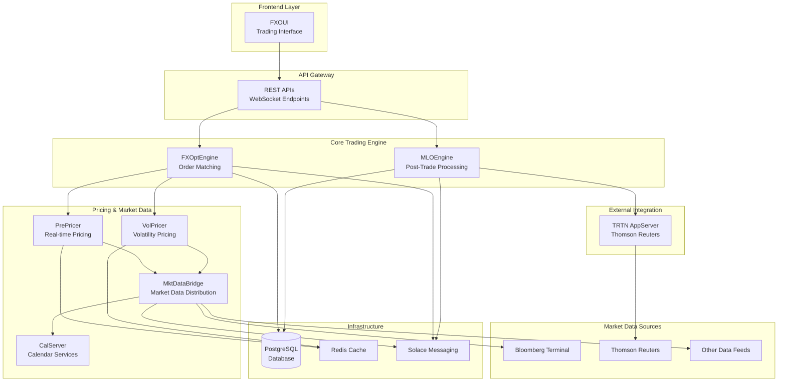
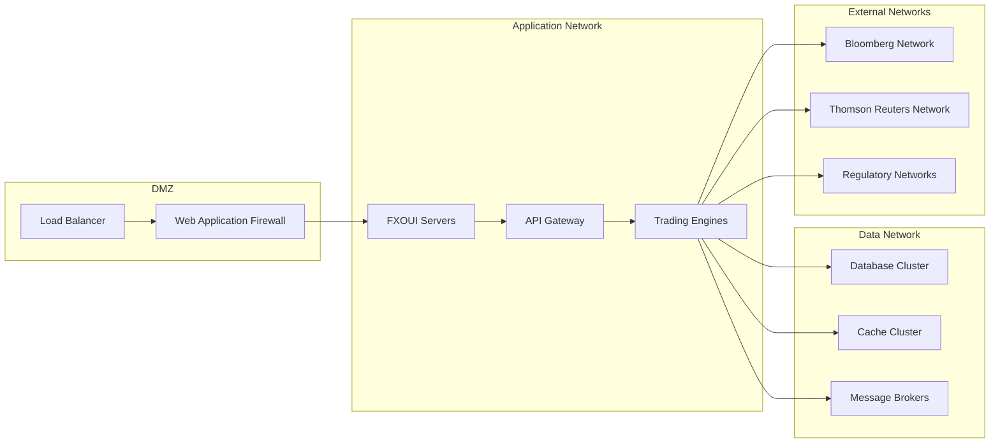
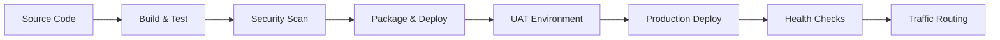



# Stream Systems Platform Architecture

{: .fs-3 }
Technical architecture and component integration overview
{: .fs-6 .fw-300 }

---

## System Architecture Overview

Stream Systems operates a sophisticated **multi-tier distributed architecture** designed for high-frequency institutional FX options trading. The platform integrates 8 specialized components through advanced messaging systems, providing end-to-end trading capabilities from order entry to settlement.

### Architecture Design Principles

<div class="content-section" markdown="1">

#### ⚡ **High Performance**
- Microsecond-level order processing with C++ core engines
- Real-time market data processing at sub-second frequencies
- Lock-free data structures and optimized memory management

#### 🔒 **Enterprise Security**
- Multi-layer security architecture with authentication and authorization
- Encrypted data transmission and secure credential management
- Comprehensive audit trails and regulatory compliance

#### 📈 **Scalability**
- Horizontal scaling through distributed messaging
- Connection pooling and caching for high-throughput operations
- Load balancing and failover capabilities

#### 🔧 **Reliability**
- Fault-tolerant design with automated failover
- Comprehensive error handling and recovery mechanisms
- Real-time monitoring and alerting systems

</div>

---

## Component Integration Map



---

## Data Flow Architecture

### 1. Market Data Flow

**Real-Time Market Data Processing:**

```
Bloomberg/Reuters → MktDataBridge → Solace Messaging → PrePricer/VolPricer → Redis Cache → Trading Components
```

<div class="content-section" markdown="1">

#### **Market Data Acquisition**
- **Bloomberg API**: Real-time spot rates, forward points, volatility surfaces
- **Thomson Reuters**: Additional market data feeds and news
- **Data Validation**: Comprehensive quality checks and filtering

#### **Data Processing Pipeline**
- **MktDataBridge**: Aggregates and normalizes market data from multiple sources
- **LMAX Disruptor**: High-performance event processing for low-latency updates
- **Hazelcast Clustering**: Distributed caching for scalability and fault tolerance

#### **Data Distribution**
- **Redis Cache**: High-speed data access for pricing engines
- **Solace Messaging**: Reliable message delivery to all consuming components
- **Real-time Updates**: Sub-second market data propagation

</div>

### 2. Trading Workflow

**Order-to-Settlement Process:**

```
FXOUI → FXOptEngine → PrePricer/VolPricer → MLOEngine → TRTN AppServer → External Systems
```

<div class="content-section" markdown="1">

#### **Order Entry & Validation**
1. **FXOUI**: Web-based trading interface with real-time updates
2. **Order Validation**: Risk checks, credit limits, and regulatory compliance
3. **Price Discovery**: Real-time pricing through PrePricer and VolPricer

#### **Order Execution**
1. **FXOptEngine**: Central order matching with price-time priority
2. **Risk Management**: Pre-trade and post-trade risk controls
3. **Trade Confirmation**: Real-time execution reports and confirmations

#### **Post-Trade Processing**
1. **MLOEngine**: Trade capture, validation, and enrichment
2. **Settlement Processing**: T+2 settlement date calculations via CalServer
3. **Regulatory Reporting**: Automated SEF and regulatory submissions

#### **External Settlement**
1. **TRTN AppServer**: Thomson Reuters network integration
2. **STP Processing**: Straight-through processing to counterparties
3. **Confirmation Management**: Trade confirmation and settlement coordination

</div>

---

## Technology Stack Integration

### Frontend Technologies
| Component | Technology | Purpose |
|-----------|------------|---------|
| **FXOUI** | React 18.2, TypeScript 3.9, MobX 6.6 | Modern responsive trading interface |
| **Real-time Updates** | SignalR 3.0, WebSockets | Live market data and order updates |
| **State Management** | MobX with React Context | Reactive state management |

### Backend Services
| Component | Technology | Purpose |
|-----------|------------|---------|
| **FXOptEngine** | C++17, Boost Libraries | High-performance order matching |
| **MLOEngine** | C++11, QuickFIX | Post-trade processing engine |
| **PrePricer** | C++17, Bloomberg API | Real-time pricing engine |
| **VolPricer** | Java 8, Spring Boot 2.1.6 | Volatility surface construction |
| **MktDataBridge** | Java 8, Spring Boot 2.1.6 | Market data aggregation |
| **CalServer** | Java 8, Spring Boot 2.1.6 | Financial calendar services |
| **TRTN AppServer** | Java 8, Spring Boot 2.1.6 | External system integration |

### Infrastructure & Messaging
| Component | Technology | Purpose |
|-----------|------------|---------|
| **Database** | PostgreSQL with connection pooling | Persistent data storage |
| **Caching** | Redis, Hazelcast | High-performance data caching |
| **Messaging** | Solace PubSub+, FIX Protocol | Reliable message delivery |
| **Market Data** | Bloomberg BLPAPI, Thomson Reuters | External data feeds |

---

## Security Architecture

### Authentication & Authorization

<div class="content-section" markdown="1">

#### **Multi-Layer Security**
- **Frontend Authentication**: JWT tokens with role-based access control
- **API Security**: OAuth2 authentication for REST endpoints
- **Service-to-Service**: Mutual TLS for internal component communication
- **Database Security**: Encrypted connections and credential management

#### **Data Protection**
- **Encryption in Transit**: TLS 1.3 for all network communications
- **Encryption at Rest**: AES-256 for sensitive data storage
- **Key Management**: Hardware security modules for cryptographic keys
- **Audit Logging**: Comprehensive security event logging

</div>

### Network Security



---

## Performance Architecture

### Low-Latency Design

{: .highlight-box }
**Performance Target**: End-to-end order processing in under 100 microseconds for standard FX options trades.

<div class="content-section" markdown="1">

#### **Hardware Optimization**
- **CPU Affinity**: Dedicated cores for latency-critical processes
- **Memory Management**: Pre-allocated memory pools and lock-free data structures
- **Network Optimization**: Kernel bypass networking for market data feeds
- **Storage Performance**: NVMe SSDs with database optimization

#### **Software Optimization**
- **Algorithm Efficiency**: O(log n) order matching algorithms
- **Caching Strategies**: Multi-level caching from L1 CPU cache to Redis
- **Connection Pooling**: Optimized database and service connections
- **Garbage Collection**: Tuned JVM settings for minimal pause times

</div>

### Scalability Patterns

**Horizontal Scaling Capabilities:**
- **Stateless Services**: All business logic services designed for horizontal scaling
- **Database Sharding**: Partitioned data across multiple database instances
- **Cache Distribution**: Distributed caching with consistent hashing
- **Load Distribution**: Round-robin and weighted load balancing

---

## Reliability & Failover

### High Availability Design

<div class="content-section" markdown="1">

#### **Redundancy Patterns**
- **Active-Active Database**: PostgreSQL streaming replication
- **Cache Clustering**: Hazelcast distributed cache with partition tolerance
- **Message Queue Clustering**: Solace high-availability configurations
- **Service Redundancy**: Multiple instances of each critical service

#### **Failover Mechanisms**
- **Automatic Failover**: Health checks with automatic service switching
- **Circuit Breakers**: Prevent cascade failures in distributed systems
- **Graceful Degradation**: Reduced functionality during partial failures
- **Disaster Recovery**: Cross-site replication and backup procedures

</div>

### Monitoring & Alerting

**Real-time System Monitoring:**
- **Application Performance**: Response times, throughput, error rates
- **Infrastructure Health**: CPU, memory, disk, network utilization
- **Business Metrics**: Trade volumes, pricing accuracy, settlement rates
- **Security Monitoring**: Authentication failures, suspicious access patterns

---

## Deployment Architecture

### Environment Strategy

| Environment | Purpose | Configuration |
|-------------|---------|---------------|
| **Development** | Active development and unit testing | Single-node deployments |
| **UAT** | User acceptance testing and integration | Production-like multi-node |
| **Production** | Live trading operations | Full high-availability cluster |
| **Disaster Recovery** | Business continuity | Cross-site replication |

### Deployment Pipeline



<div class="content-section" markdown="1">

#### **Continuous Integration/Deployment**
- **Automated Testing**: Unit, integration, and performance tests
- **Security Scanning**: Vulnerability assessment and dependency checking
- **Blue-Green Deployment**: Zero-downtime production deployments
- **Rollback Capability**: Automated rollback on deployment failures

</div>

---

## Integration Points

### External System Connectivity

<div class="content-section" markdown="1">

#### **Market Data Providers**
- **Bloomberg Terminal**: Real-time market data via BLPAPI
- **Thomson Reuters**: Additional market data feeds and regulatory data
- **Alternative Data Sources**: Additional market data vendors as needed

#### **Trading Networks**
- **Thomson Reuters Trading Network (TRTN)**: Institutional trade execution
- **SEF Venues**: Swap execution facility connectivity for regulatory trading
- **Bank Networks**: Direct connectivity to major investment banks

#### **Regulatory Systems**
- **DTCC**: Trade reporting and regulatory submissions
- **CFTC**: Commodity Futures Trading Commission reporting
- **EU Regulatory**: MiFID II and EMIR compliance reporting

</div>

### API Architecture

**RESTful API Design:**
- **Versioned APIs**: Backward compatibility through API versioning
- **Rate Limiting**: Prevent system overload from excessive requests
- **Documentation**: Comprehensive OpenAPI/Swagger documentation
- **SDK Support**: Client libraries for major programming languages

---

## Current State Assessment

### ✅ **Production-Ready Components**
- **Core Trading Logic**: FXOptEngine and MLOEngine provide robust trading capabilities
- **Market Data Processing**: MktDataBridge successfully handles real-time data feeds
- **Pricing Engines**: PrePricer and VolPricer deliver accurate institutional-grade pricing

### ⚠️ **Components Requiring Updates**
- **Security Framework**: Authentication and authorization systems need modernization
- **Technology Stack**: Upgrade from Java 8 and Spring Boot 2.1.6 to current versions
- **Performance Optimization**: Caching and memory management improvements needed

### 🔧 **Operational Readiness**
- **Monitoring**: Enhanced observability and alerting capabilities needed
- **Deployment**: Automated CI/CD pipeline implementation required
- **Documentation**: Operational runbooks and procedures need completion

---

*For detailed analysis of individual components, see the component-specific documentation pages. For technical risk assessment, see [Technical Risk Assessment](technical-risk-assessment.html).*

---

**Architecture Review Date**: July 17, 2025  
**Next Architecture Review**: January 17, 2026 